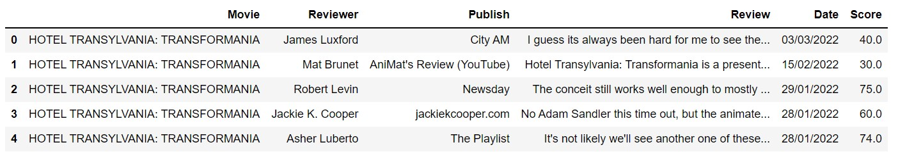
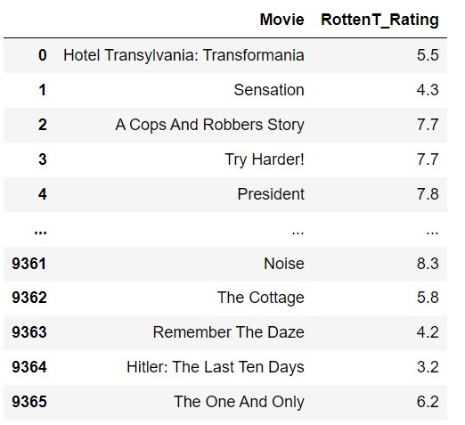
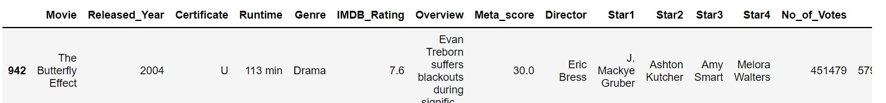
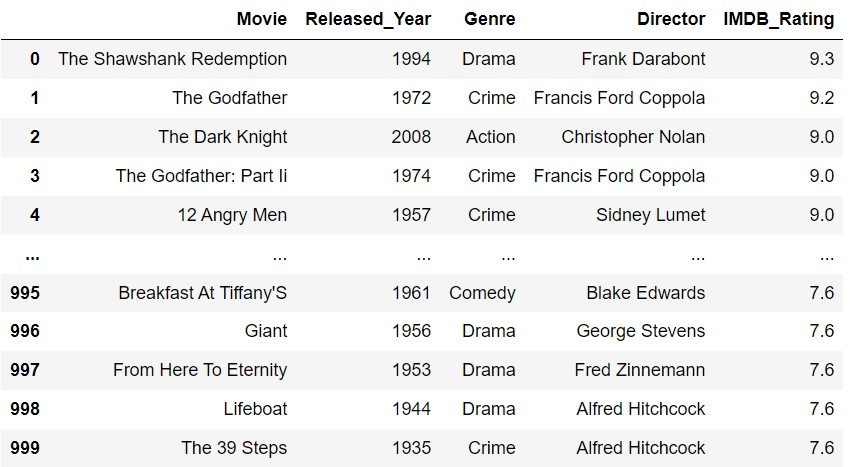
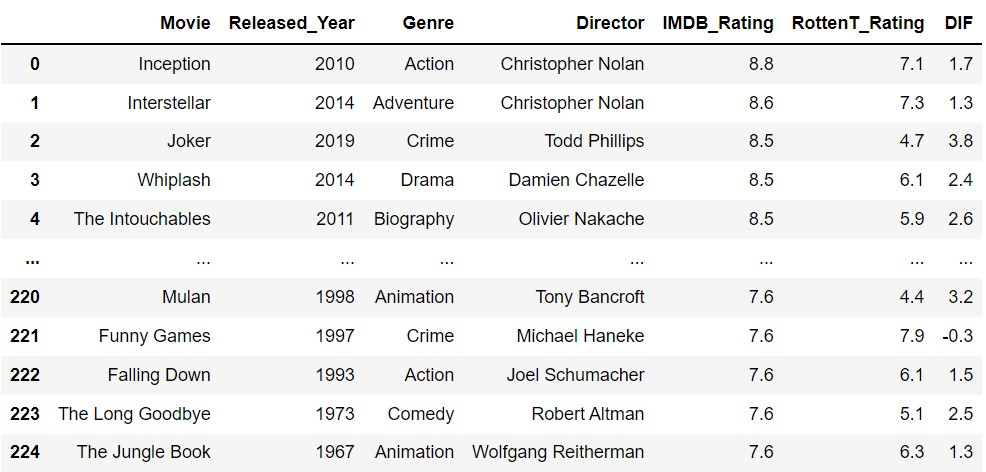

# Project II 
##( _README not complete_)

For this project I will study the online rating sites Rotten Tomatoes and IMDb

### Rotten Tomatoes and IMDb or Internet Movie Database are very popular film review sites that help people to look up and know about films. These are online sources that help people decide whether to watch a film or not.

While Imdb ratings of 1-10 are based upon reviews of the audiences, Rotten Tomatoes bases its ratings upon reviews from certified members of writing guilds. Both are subjective but carry enough respect in the minds of the audiences.

IMDb ratings are based upon reviews of the audiences, while Rotten Tomatoes bases its ratings upon reviews from certified members

 # GETTING DATASETs

 

First of all I will get two datasets from the web platform kaggle for both websites: Rotten Tomatoes and IMDb

 

 

### DATASET #1

#### Rotten Tomatoes dataset cleaned

The final dataset from Rotten Tomatoes:

### DATASET #2

#### IMDb dataset

  #### Dataset IMDb clenead
  

  ##### For the next step I create an empty dataset where I will combine both datasets, matching the names of the movies and inally this is my combined dataset 

